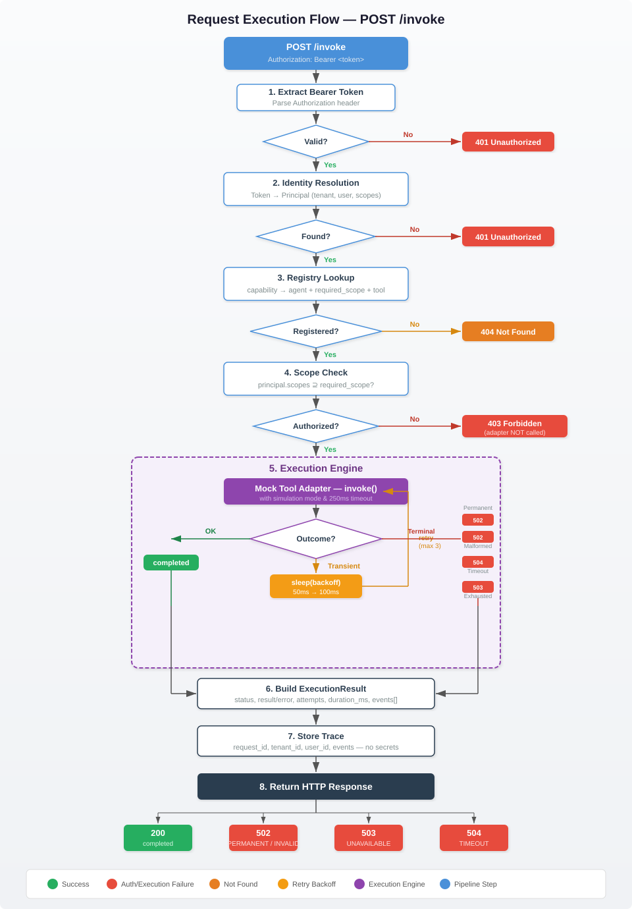
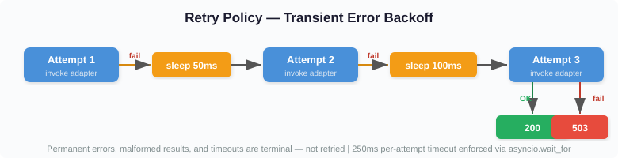
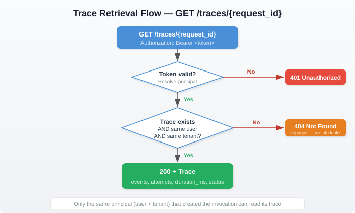

# Observable Agent Gateway

> **[View Assessment Report](docs/assessment_report.html)** — Architecture, test results, and design decisions in one page. Auto-updates on every test and acceptance run.

A production-structured, observable agent gateway built with **Python 3.11+** and **FastAPI**. Resolves capabilities, enforces identity and scope-based permissions, invokes mock tool adapters with failure simulation, enforces retry/timeout policies, and records structured execution traces.

---

## Quick Start

A single script handles setup, dependencies, and execution:

```bash
  # Show all available commands
./start_service.sh --helper

# Start the service (auto-detects python3.11+, creates venv, installs deps)
./start_service.sh

# Run tests only
./start_service.sh --test

# Docker: build + run
./start_service.sh --docker

# Docker: build + test (--network none, proves no external calls)
./start_service.sh --docker --test
```

### Manual Setup (if preferred)

```bash
  python3.11 -m venv .venv
  source .venv/bin/activate
  pip install -r requirements.txt
  python -m pytest -q
  uvicorn service.main:app --host 0.0.0.0 --port 8000 --workers 1
```

### Docker (manual)

```bash
    docker build -t dharmendra-agent-gateway .
    docker run --rm --network none dharmendra-agent-gateway python -m pytest -q
    docker run --rm -p 127.0.0.1:8000:8000 dharmendra-agent-gateway
```

### Acceptance Check (separate terminal)

```bash
  python tools/acceptance_check.py --base-url http://127.0.0.1:8000
```

---

## Request Execution Flow



### Retry Policy



### Trace Retrieval



---

## API Endpoints

### `GET /health`

Unauthenticated. Returns `{"status": "ok"}`.

### `POST /invoke`

Invoke an agent capability. Requires `Authorization: Bearer <token>`.

**Request:**
```json
{
  "conversation_id": "conversation-001",
  "capability": "billing.summary",
  "message": "Show my billing summary.",
  "simulation": "ok"
}
```

**Success (200):**
```bash
  curl -s http://127.0.0.1:8000/invoke \
  -H "Authorization: Bearer demo-alpha-full" \
  -H "Content-Type: application/json" \
  -d '{"conversation_id":"c1","capability":"billing.summary","message":"Show billing.","simulation":"ok"}'
```
```json
{
  "request_id": "req-...",
  "conversation_id": "c1",
  "tenant_id": "tenant-a",
  "agent": "billing-agent",
  "status": "completed",
  "result": {"amount_due": 42.0, "currency": "USD"}
}
```

**Failure — insufficient scope (403):**
```bash
  curl -s http://127.0.0.1:8000/invoke \
  -H "Authorization: Bearer demo-alpha-sales" \
  -H "Content-Type: application/json" \
  -d '{"conversation_id":"c1","capability":"billing.summary","message":"Show billing."}'
```
```json
{"error": {"code": "FORBIDDEN", "message": "Insufficient permissions."}}
```

**Failure — timeout (504):**
```bash
  curl -s http://127.0.0.1:8000/invoke \
  -H "Authorization: Bearer demo-alpha-full" \
  -H "Content-Type: application/json" \
  -d '{"conversation_id":"c1","capability":"billing.summary","message":"test","simulation":"timeout"}'
```
```json
{
  "request_id": "req-...",
  "conversation_id": "c1",
  "tenant_id": "tenant-a",
  "agent": "billing-agent",
  "status": "failed",
  "error": {"code": "UPSTREAM_TIMEOUT", "message": "The tool did not respond in time."}
}
```

### `GET /traces/{request_id}`

Retrieve the execution trace for a completed or failed invocation. Same bearer auth required; only the principal who made the request can access its trace.

**Example** (use the `request_id` from a previous `/invoke` response):
```bash
  # First invoke to get a request_id
  REQUEST_ID=$(curl -s http://127.0.0.1:8000/invoke \
  -H "Authorization: Bearer demo-alpha-full" \
  -H "Content-Type: application/json" \
  -d '{"conversation_id":"c1","capability":"billing.summary","message":"test","simulation":"transient_then_ok"}' \
  | python3 -c "import sys,json; print(json.load(sys.stdin)['request_id'])")

  # Retrieve the trace
  curl -s http://127.0.0.1:8000/traces/$REQUEST_ID \
  -H "Authorization: Bearer demo-alpha-full" | python3 -m json.tool
```
```json
{
  "request_id": "req-...",
  "conversation_id": "c1",
  "tenant_id": "tenant-a",
  "agent": "billing-agent",
  "capability": "billing.summary",
  "status": "completed",
  "attempts": 3,
  "duration_ms": 152.3,
  "events": [
    {"event": "attempt_started", "attempt": 1},
    {"event": "attempt_failed", "attempt": 1, "code": "TRANSIENT"},
    {"event": "retry_scheduled", "attempt": 1, "delay_ms": 50},
    {"event": "attempt_started", "attempt": 2},
    {"event": "attempt_failed", "attempt": 2, "code": "TRANSIENT"},
    {"event": "retry_scheduled", "attempt": 2, "delay_ms": 100},
    {"event": "attempt_started", "attempt": 3},
    {"event": "attempt_succeeded", "attempt": 3}
  ]
}
```

---

## Simulation Modes

| Mode | Adapter Behavior | HTTP | Error Code |
|------|-----------------|------|------------|
| `ok` | Returns fixture result | 200 | — |
| `transient_then_ok` | Fails 2×, succeeds on attempt 3 | 200 | — |
| `transient_always` | All 3 attempts fail | 503 | `UPSTREAM_UNAVAILABLE` |
| `permanent_error` | Non-retryable error, attempt 1 | 502 | `UPSTREAM_PERMANENT` |
| `malformed_result` | Invalid schema returned | 502 | `INVALID_TOOL_RESULT` |
| `timeout` | 2s sleep, 250ms timeout enforced | 504 | `UPSTREAM_TIMEOUT` |

---

## Demo Identities

| Token | Principal | Tenant | Scopes |
|-------|-----------|--------|--------|
| `demo-alpha-full` | `user-a` | `tenant-a` | `billing:read`, `sales:read` |
| `demo-alpha-sales` | `user-c` | `tenant-a` | `sales:read` |
| `demo-beta-full` | `user-b` | `tenant-b` | `billing:read`, `sales:read` |

---

## Project Architecture

```
├── service/
│   ├── main.py                    # Thin entry point: create_app()
│   ├── core/
│   │   ├── config.py              # Settings dataclass (frozen)
│   │   ├── errors.py              # Error hierarchy (gateway errors)
│   │   ├── logging.py             # JSON formatter + sensitive field redaction
│   │   └── factory.py             # App wiring, fixture loading, agent building
│   ├── identity/
│   │   └── resolver.py            # Token → Principal resolution
│   ├── registry/
│   │   ├── models.py              # AgentRegistration dataclass
│   │   └── capability_registry.py # Capability → agent + scope mapping
│   ├── agents/
│   │   ├── base.py                # BaseAgent protocol (with system_prompt)
│   │   ├── billing_agent.py       # YAML-configured billing agent
│   │   ├── sales_agent.py         # YAML-configured sales agent
│   │   ├── prompts/
│   │   │   ├── billing_agent.yaml # Externalized agent config + system prompt
│   │   │   └── sales_agent.yaml
│   │   └── tools/
│   │       ├── base.py            # Tool protocol
│   │       ├── billing_tool.py    # BillingSummaryTool with result validation
│   │       └── sales_tool.py      # SalesOffersTool with result validation
│   ├── adapter/
│   │   ├── mock_adapter.py        # 6 simulation modes, per-invocation state
│   │   └── validators.py          # Schema validation per capability
│   ├── executor/
│   │   ├── engine.py              # Retry loop, backoff, timeout, event recording
│   │   └── models.py              # ExecutionResult dataclass
│   ├── traces/
│   │   └── store.py               # In-memory trace store with TTL expiration
│   ├── api/
│   │   ├── routes.py              # /health, /invoke, /traces/{id}
│   │   ├── schemas.py             # Pydantic request/response models
│   │   ├── dependencies.py        # Auth extraction + principal resolution
│   │   └── middleware.py          # Request context, X-Request-ID, logging
│   └── tests/
│       ├── conftest.py            # Shared fixtures (mock sleep, app, client)
│       └── test_gateway.py        # 40 tests across 8 categories
├── fixtures/
│   └── scenario.json              # Demo identities + synthetic tool results
├── tools/
│   └── acceptance_check.py        # 14-point HTTP checker
├── start_service.sh               # Single entry point (native + Docker)
├── Dockerfile                     # python:3.11-slim, non-root user
├── requirements.txt
├── pyproject.toml
├── ASSESSMENT.md
├── SUBMISSION_NOTES.md
└── README.md
```

---

## Security Model

- Tokens resolved by **exact lookup** from fixture — no JWT, no crypto
- Scope check happens **before** adapter invocation (403 = adapter never called)
- `X-Tenant-ID`, `X-Scopes` headers are **ignored** — principal comes from token only
- Unknown body fields (e.g. `user_id`, `tenant_id`) are **silently ignored**
- Error responses **never expose** stack traces, token values, or raw tool payloads
- Debug logs **redact** bearer tokens, message text, and tool-result bodies
- Trace access enforced by **same user + same tenant** — no admin bypass

### Production OIDC Migration Path

The current `IdentityResolver` does exact token lookup. In production, replace it with:

1. Validate JWT signature against the OIDC provider's JWKS endpoint
2. Extract `sub` (user), `tenant_id`, and `scope` claims from the verified token
3. Map claims to the same `Principal` dataclass — no downstream changes needed

The resolver is a protocol-based interface; swapping implementations requires no changes to routing, authorization, or the execution engine.

---

## Test Coverage

40 tests across 8 classes covering all 7 required categories:

| Category | Tests | What's Proved |
|----------|-------|---------------|
| Capability routing | 4 | Both agents route correctly, unknown → 404, health works |
| Auth & authorization | 10 | Missing/bad/empty tokens → 401, wrong scope → 403, adapter not called |
| Tenant isolation | 7 | Cross-tenant results isolated, cross-tenant/user traces → 404 |
| Simulation modes | 8 | All 6 modes, retry delays verified with injected clock |
| Concurrent isolation | 2 | Barrier-synchronized overlapping requests, separate traces |
| Timeout cancellation | 1 | Late result cannot overwrite failed trace |
| Secret redaction | 4 | Secrets absent from traces, logs, error responses |
| Edge cases | 4 | Unique IDs, format, unknown fields ignored, unauth trace → 401 |

---

## Known Limitations

- **In-memory state** — all traces lost on process restart
- **Single-process** — no horizontal scaling (by design per assessment)
- **No persistent conversation history** — `conversation_id` is a correlation label only
- **TTL expiration is lazy** — expired traces cleaned on read, not background
- **Mock agents** — no real LLM calls (assessment constraint: `--network none`)
